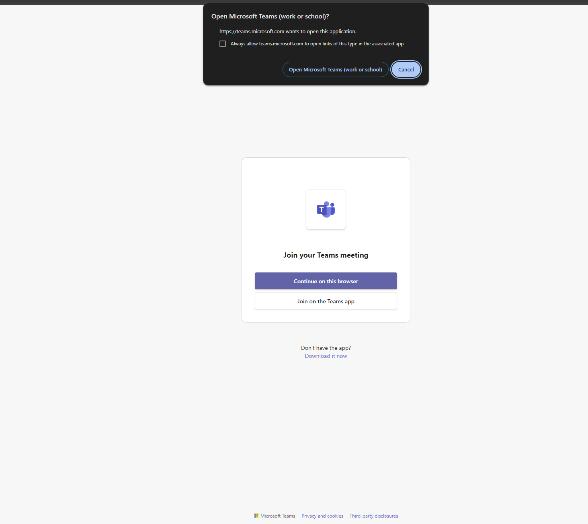

# Force Microsoft Teams in Browser

When you open an Microsoft Teams meeting link
in your browser, Teams tries to open that link in its desktop app

This is not always wanted, but there is no easy way to get rid of that annoying dialog

Now, any time you visit a meetup link, Teams will not ask you to open the desktop app.

## Install

https://chrome.google.com/webstore/detail/........

## Contributing

PRs and bug reports are welcome!

### Local Development

1. Go to <chrome://extensions>
2. Check the "Developer mode" option in the upper right corner
3. Click *Load Unpacked Extension* and select this folder

If you make changes `src/app.js`, you need to reload the extension which you can do by Cmd-R
reloading <chrome://extensions>. Then you need to reload the archive link you're testing.
